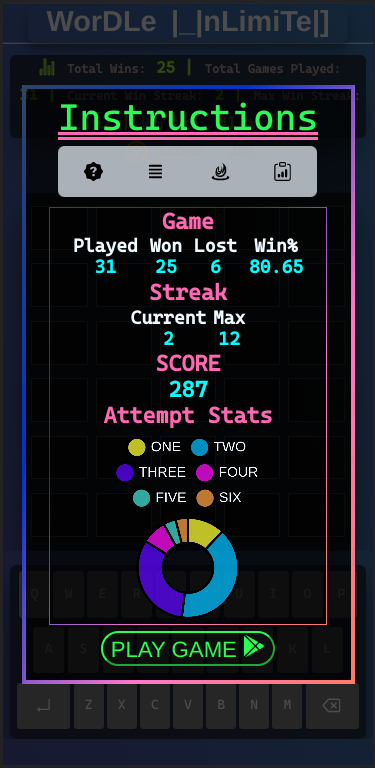

# 
 **Wordle Unlimited Gallery** 

<!-- PROJECT LOGO -->
 

  

  

     
    <a href="https://github.com/VENGENCE7/Wordle_Unlimited"><strong>Back To Repo »</strong></a>
     
     
    <a href="#regular-rounds">Regular Rounds</a>
    &ensp;:+:&ensp;
    <a href="#modal">Modal</a>
    &ensp;:+:&ensp;
    <a href="#bonus-rounds">Bonus Rounds</a>
    &ensp;:+:&ensp;
    <a href="#stats-graph">Stats Graph</a>
    

 

<!-- RR -->  
# Regular Rounds

 
  
 
  
 
  
 &ensp;  
 &ensp; 
 
 
  
 
  
 
  
 
  
 

[<a href="#top">Back to top</a>]

 

<!-- M -->  
# Modal

 
  
 
  
 
  
 

[<a href="#top">Back to top</a>]

 

<!-- BR -->  
# Bonus Rounds

 
  
 
  
 
  &ensp;  
 
  
 
  
 

[<a href="#top">Back to top</a>]

 

<!-- SG -->  
# Stats Graph

 
  
 
  
 
  
 
 

[<a href="#top">Back to top</a>]

 

